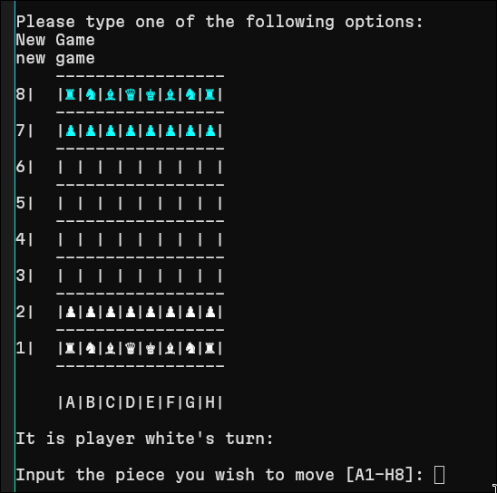
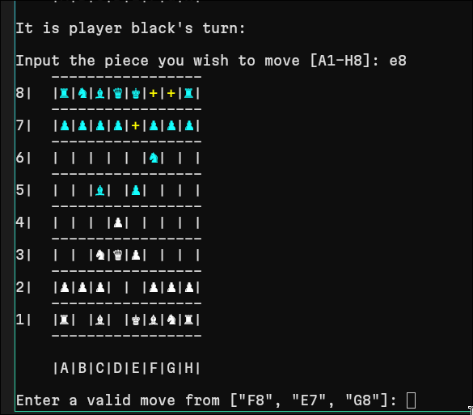
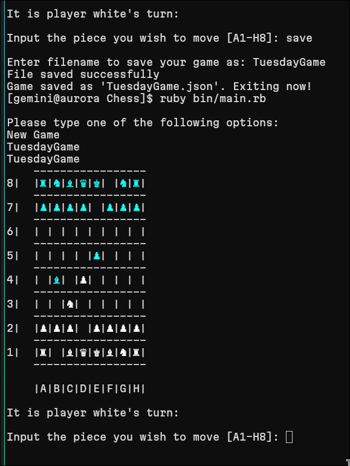
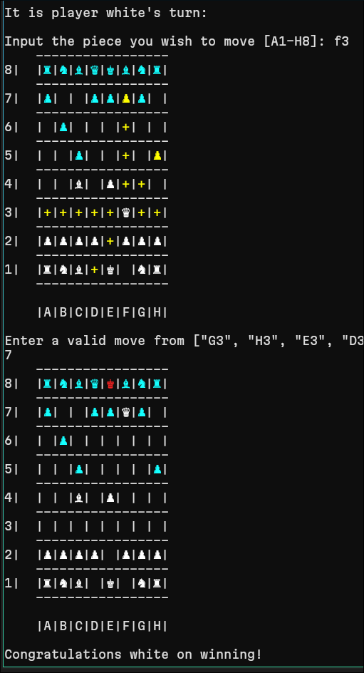

# Ruby Chess

A terminal-based chess game written in Ruby, built as an object-oriented programming project. The game implements the main rules of chess, validates legal moves, tracks game-ending states, and supports saving and reloading games from disk.

This repository is intended to show practical Ruby design, domain modelling, command-line interaction, test coverage, and file-based persistence.

## Screenshots

| New game | Legal move highlighting |
|----------|-------------------------|
|  |  |

| Loading a saved game | Checkmate |
|----------------------|-----------|
|  |  |

## Features

- Interactive two-player chess game in the terminal
- Object-oriented piece model with dedicated classes for kings, queens, rooks, bishops, knights, pawns, and blank squares
- Legal move generation and validation for each piece
- Rule support for castling, en passant, and pawn promotion
- Check, checkmate, and stalemate detection
- Legal move highlighting on the terminal board
- Save and resume support using JSON files
- RSpec test coverage for board logic, helpers, and chess mechanics

## Tech Stack

- Ruby
- RSpec
- Bundler
- JSON file persistence
- `colorize` for terminal board output

## Architecture

| Component | Responsibility |
|-----------|----------------|
| `Board` | Owns the board state, piece positions, legal move lookup, check state, and board rendering |
| `Piece` subclasses | Encapsulate movement behavior and state for each chess piece |
| `Mechanics` | Handles chess-specific mechanics such as castling, en passant, promotion, checkmate, and stalemate |
| `Gameloop` | Coordinates player turns, prompts, move selection, saving, loading, and game completion |
| `Helpers` | Converts between board coordinates, tile names, pieces, and symbols |
| `FileManager` | Saves and loads JSON game state |

## Getting Started

### Prerequisites

- Ruby 3.0 or higher
- Bundler

### Installation

```bash
git clone https://github.com/RicardPriv/Chess.git
cd Chess
bundle install
mkdir saves
```

The `saves/` folder is required for saving and loading games.

### Run the Game

```bash
ruby bin/main.rb
```

### Run the Tests

```bash
bundle exec rspec
```

## How to Play

When the game starts, choose `New Game` or enter the name of an existing saved game without the `.json` extension.

During a turn:

- Enter the coordinate of the piece to move, for example `E2`
- Enter the destination coordinate, for example `E4`
- Type `b` when choosing a destination to go back and select another piece
- Type `save` during most prompts to save the current game and exit
- Type `e` to exit

The board highlights valid destinations for the selected piece before the destination prompt.

## Project Notes

This project focuses on modelling a rule-heavy domain without relying on a chess engine library. The implementation separates board state, piece movement, game flow, persistence, and helper logic so that each part can be tested and changed independently.
